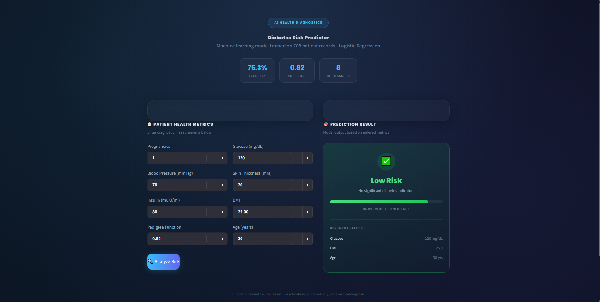

# 🩺 Diabetes Prediction System

A Machine Learning project that predicts whether a patient is likely to have diabetes, based on health metrics like glucose level, BMI, and age. Built as part of my AI/ML internship, following my earlier House Price Prediction (Regression) project.

---

## Overview

*   **Type:** Classification (predicts Yes/No, unlike my previous Regression project)
*   **Dataset:** Pima Indians Diabetes Dataset (Kaggle)
*   **Goal:** Predict `Outcome` (0 = No Diabetes, 1 = Diabetes) using 8 health features
*   **Rows:** 768 patient records

---

## Tech Stack

*   Python
*   pandas, numpy
*   matplotlib, seaborn
*   scikit-learn
*   joblib
*   Streamlit (web app)

---

## Project Structure

```
Disease-Prediction-System/
├── data/           → diabetes.csv
├── notebooks/      → disease_prediction.ipynb (full analysis)
├── models/         → saved model + scaler
├── app/            → app.py (Streamlit web app)
├── images/         → plots used in the notebook
├── requirements.txt
└── README.md
```

---

## What I Did

*   **Loaded and explored the data** – checked shape, data types, missing values, and class balance (500 non-diabetic vs 268 diabetic – slightly imbalanced)
*   **Cleaned the data** – found that some columns (Glucose, BMI, BloodPressure, etc.) had `0` values that were actually missing data, not real values. Replaced them with the median
*   **Visualized the data** – histograms, boxplots, correlation heatmap, and compared glucose levels between diabetic and non-diabetic patients
*   **Scaled the features** using StandardScaler (needed for KNN and SVM to work properly)
*   **Trained 4 models** and compared them (see Results below)
*   **Evaluated using more than just accuracy** – Precision, Recall, F1-score, Confusion Matrix, and ROC-AUC (0.82), since accuracy alone can be misleading on imbalanced data
*   **Tuned the model** using cross-validation and GridSearchCV
*   **Checked feature importance** – Glucose turned out to be the most important predictor, followed by BMI and Age
*   **Saved the final model** using joblib
*   **Built a Streamlit app** with a custom medical-themed UI, so the model can actually be used, not just sit in a notebook

---

## Results

| Model | Accuracy |
| --- | --- |
| Logistic Regression | 75.3% |
| SVM | 74.7% |
| Random Forest | 73.4% |
| KNN | 72.1% |

**Final model:** Logistic Regression (highest accuracy, ROC-AUC 0.82)

---

## App

A Streamlit app (`app/app.py`) takes 8 patient health metrics and returns a risk prediction with a confidence score. Custom dark-themed UI with animated background, glass-panel cards, hover effects, and a short "analyzing" animation before the result appears — built to feel like a real diagnostic tool rather than a bare notebook output.


---

## How to Run

```
git clone https://github.com/omsagarmandal/Disease-Prediction-System.git
cd Disease-Prediction-System
pip install -r requirements.txt
cd app
streamlit run app.py
```

---

## What I Learned

*   Difference between Regression and Classification problems
*   How to spot "hidden" missing values (0s that shouldn't be 0)
*   Why feature scaling matters for some algorithms and not others
*   Classification metrics (Precision, Recall, F1, AUC) and why accuracy alone isn't enough
*   Comparing multiple models instead of just picking one
*   Basics of deploying a model as a usable, styled web app

---

## Note

This is a learning project, not a real medical tool. Predictions shouldn't be used for actual diagnosis.

---

**Om Sagar Mandal**  
AI/ML Intern