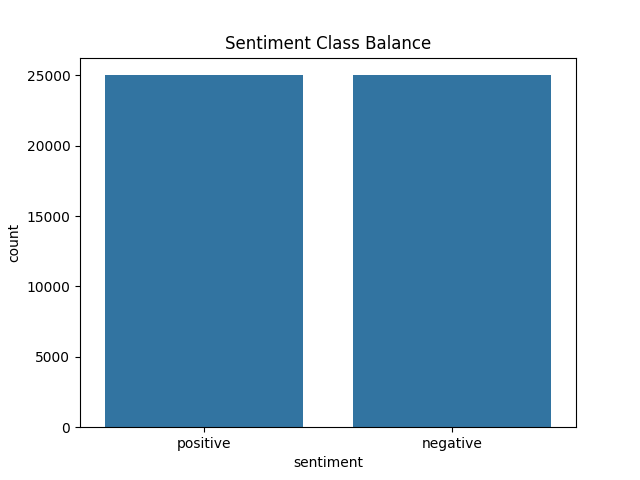
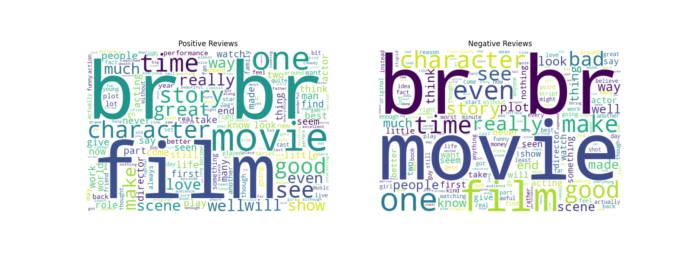
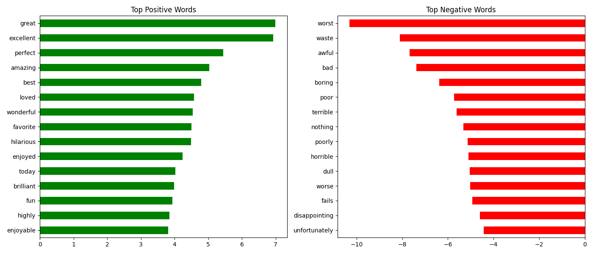

# 🎬 Movie Review Sentiment Analysis

An NLP project that predicts whether a movie review is positive or negative, using the IMDB dataset of 50,000 reviews. Built as my 3rd project, following House Price Prediction (Regression) and Diabetes Prediction (Classification) — this one covers text data and both classical ML and neural network approaches.

---

## Overview

*   **Type:** NLP / Binary Text Classification
*   **Dataset:** IMDB Dataset of 50K Movie Reviews (Kaggle)
*   **Goal:** Predict sentiment (positive/negative) from raw review text
*   **Rows:** 50,000 reviews, perfectly balanced (25K positive / 25K negative)

---

## Tech Stack

Python · pandas, numpy · matplotlib, seaborn, wordcloud · NLTK · scikit-learn · Streamlit

---

## Project Structure

```
Movie-Review-Sentiment-Analysis/
├── data/          → IMDB Dataset.csv
├── notebooks/     → full analysis notebook
├── src/           → reusable scripts
├── models/        → saved model + TF-IDF vectorizer
├── images/        → EDA charts, wordclouds, evaluation plots
├── app/           → Streamlit app
├── requirements.txt
└── README.md
```

---

## What I Did

*   **Explored the data** – confirmed a perfectly balanced dataset, checked review length distribution, and visualized common words per sentiment with wordclouds
*   **Cleaned the text** – removed HTML tags, punctuation, and stopwords; compared stemming vs lemmatization and used lemmatization for higher-quality output (real words, not truncated stems)
*   **Converted text to numbers** – compared Bag of Words vs TF-IDF; TF-IDF performed better (88.8% vs 87.0% accuracy) and was used going forward
*   **Trained and compared 4 classical models** – Logistic Regression, Naive Bayes, SVM, and Random Forest
*   **Tested a neural network** (scikit-learn's MLPClassifier) as a deep learning-style comparison alongside the classical models
*   **Tuned the best model** with GridSearchCV
*   **Checked which words drive predictions** – "great," "excellent," "perfect" push positive; "worst," "waste," "awful" push negative — confirms the model learned real sentiment signals, not noise
*   **Deployed as a Streamlit app** – paste any review, get an instant sentiment prediction with a confidence score

---

## Results

| Model | Accuracy | F1 |
| --- | --- | --- |
| **Logistic Regression (tuned)** | **0.888** | **0.889** |
| SVM (Linear) | 0.884 | 0.884 |
| Neural Network (MLP) | 0.872 | 0.873 |
| Naive Bayes | 0.853 | 0.854 |
| Random Forest | 0.846 | 0.844 |

Random Forest was also by far the slowest to train (~4.5 minutes vs ~1-2 seconds for Logistic Regression) with no accuracy benefit — a good example of why simpler models often win on high-dimensional text data.

---

## Visualizations

  
  


---

## How to Run

```
git clone https://github.com/omsagarmandal/Movie-Review-Sentiment-Analysis.git
cd Movie-Review-Sentiment-Analysis
pip install -r requirements.txt
cd app
streamlit run app.py
```

---

## Note

This is a learning project. Predictions reflect patterns in the IMDB dataset and won't generalize perfectly to all review styles or domains outside movies.

---

**Om Sagar Mandal**  
AI/ML Intern